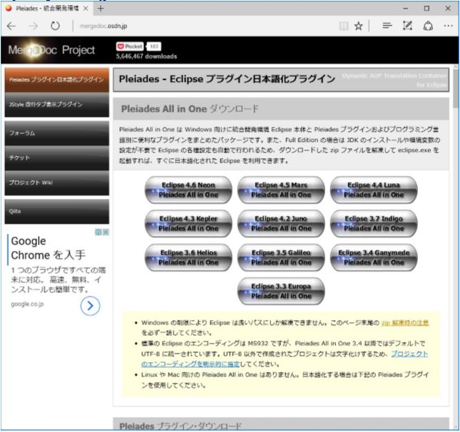

= MySQL(MariaDB) メモ
:toc:
:toc-title:
:pagenums:
:sectnums:
:imagesdir: ./
:icons: font
:source-highlighter: pygments
:pygments-style: default
// $(dirname $(gem which pygments.rb))/../vendor/pygments-main/pygmentize -L styles
:pygments-linenums-mode: inline
:lang: ja

=== インストール
---
[source,sh]
----
# yumリポジトリファイル作成(https://mariadb.com/kb/ja/yum/)
$ sudo vim /etc/yum.repos.d/MariaDB.repo

------------------------------------------------------
[mariadb]
name = MariaDB
baseurl = http://yum.mariadb.org/10.1/centos7-amd64
gpgkey=https://yum.mariadb.org/RPM-GPG-KEY-MariaDB
gpgcheck=1
------------------------------------------------------

# メタデータ更新
$ sudo yum clean metadata

# MariaDBインストール
$ sudo yum -y install MariaDB-server MariaDB-client

# MySQLへログイン
$ mysql -u root -p

# MySQL インストール
wget http://dev.mysql.com/get/mysql-community-release-el7-5.noarch.rpm
sudo yum --nogpgcheck localinstall mysql-community-release-el7-5.noarch.rpm
sudo yum --enablerepo=mysql56-community install mysql-community-server
sudo mv ./mysql-community-release-el7-5.noarch.rpm /usr/local/src/
----

=== データベースの作成・変更・削除
---
[source,sql]
----
-- データベース作成(文字コード指定)
create database db_name default character set utf8;

-- 使用可能な文字コード確認
show global variables like '%char%';

-- データベース一覧表示
show databases;

-- データベースの切替
use hoge;
----

=== テーブルの作成・変更・削除
---
[source,sql]
----
-- データベース作成(文字コード指定)
create table user_info(
  id int,
  name varchar(50)
);

insert into test values(9999,'sgym');

-- テーブル一覧表示
show tables;
----

=== ユーザ作成・権限設定
---
[source,sql]
----
-- ユーザ確認
select user,host,password from mysql.user;

-- ユーザ作成
CREATE USER 'mysql-owner'@'192.168.0.102' IDENTIFIED BY 'password';
-- ホストは指定しない場合
CREATE USER 'mysql-owner'@'%' IDENTIFIED BY 'password';

-- データベースに対する全権限を付加
grant all on `db_name`.* to 'mysql-owner'@'%';

-- 特定テーブルへに対する権限付加
GRANT ALL PRIVILEGES ON `db_name`.table_name TO 'mysql-owner'@'%';

-- クエリ別のアクセス許可(SELECT,UPDATE,INSERT,DELETE)
GRANT SELECT,UPDATE,INSERT,DELETE ON `db_name`.table_name TO 'mysql-owner'@'%';

-- 権限確認
SHOW GRANTS for 'mysql-owner'@'%';

-- ユーザ削除(削除した際、ユーザに設定されている権限情報も削除される)
DROP USER 'mysql-owner'@'%';
----

=== 設定ファイル
---
[width="100%",cols="^,^m",frame="topbot",options="header"]
|==========================
|種類                    | ファイルパス
|クライアント側設定ファイル | /etc/my.cnf.d/client.conf
|サーバ側設定ファイル      | /etc/my.cnf.d/server.conf
|==========================

./etc/my.cnf.d/client.conf
[source,sh]
----
# クライアントの文字コード設定
$ sudo cp -p /etc/my.cnf.d/client.conf{,.bk}
$ sudo vim /etc/my.cnf.d/client.conf
----

[source,sh]
----
[client]
default-character-set=utf8
----

./etc/my.cnf.d/server.conf
[source,sh]
----
# サーバーの文字コード設定
$ sudo cp -p /etc/my.cnf.d/server.conf{,.bk}
$ sudo vim /etc/my.cnf.d/server.conf
----

[source,sh]
----
[mysqld]
character-set-server=utf8
----

変更後は再起動すること
[source,sh]
----
$ sudo systemctl restart mariadb
----

=== その他
---
[source,sh]
----
# バックアップ
# 特定のデータベースを指定してファイルに吐き出す
mysqldump -u root -p ${db_name} > dump.sql

# リストア
# リストア先のデータベースとリストア対象のファイルを指定する
mysql -u root -p ${db_name} < dump.sql
----

=== MySQLのサービス公開
---
[source,sh]
----
$ sudo systemctl start mariadb
$ sudo systemctl enable mariadb
$ sudo systemctl is-enabled mariadb

# MySQLのサービス公開
$ sudo firewall-cmd --list-all
$ sudo firewall-cmd --permanent --add-service=mysql
$ sudo firewall-cmd --permanent --add-port=3306/tcp
$ sudo firewall-cmd --reload
$ sudo firewall-cmd --list-all
----
